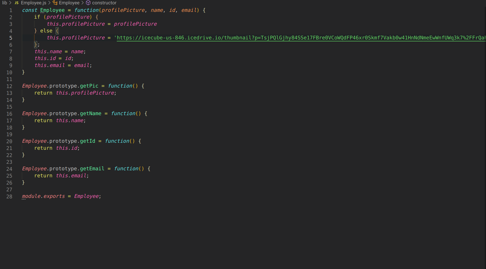
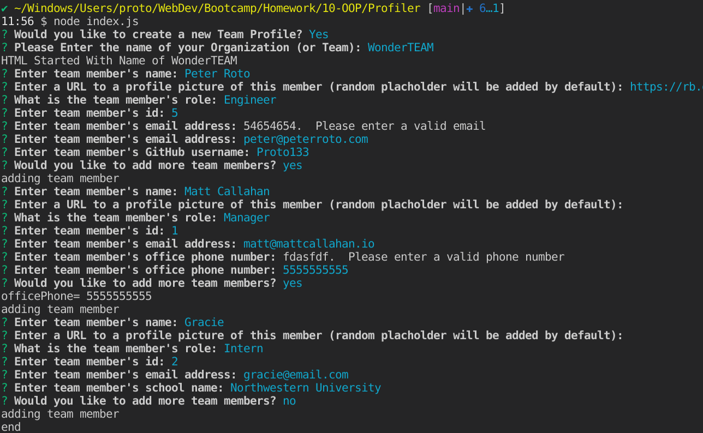
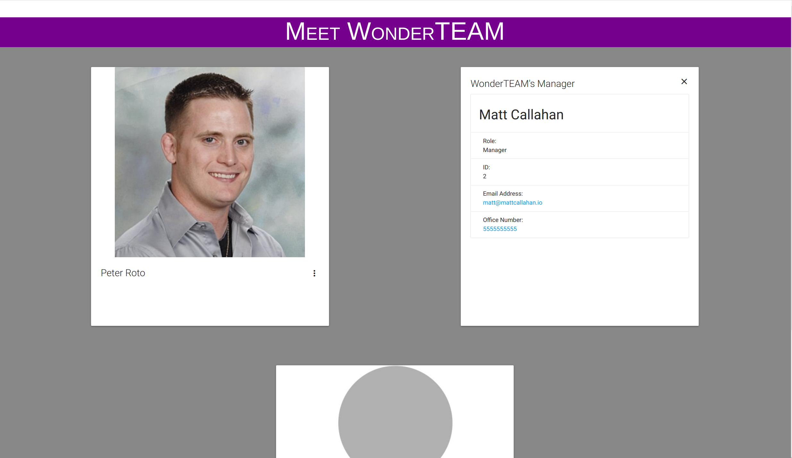

  <h1 align="center">Profiler 🎉 </h1>
    
  <br />
  
  ## 👇  Description  👇
---
  
  An application built with Nodejs that allows the user to create a profeesional looking team profile page for a project by simply answering a few prompts in the console.
 
  ## Table of Contents 
  - [Description](#--description--)
  - [Installation Instructions 📣](#installation-instructions-)
  - [Usage 🖱️](#usage-️)
  - [Contributors 🧑‍🤝‍🧑](#contributors-)
  - [Screenshots 📷](#screenshots-)
  - [Questions ❔](#questions-)
  - [License ©️](#license-️)
    
  ## Installation Instructions 📣
---

  Currently, clone repo to desired directory,navigate into that directory-- then, run 
  ```
  npm i
  ```
  to install dependencies.
  
  ## Usage 🖱️
---

  -Navigate into the directory of the cloned repo.   
    *Make Sure to have NODEJS installed*
 
  -Open terminal there and type 
 
  ```
  node index.js
  ```
 and press <code>enter</code>  
 -Respond to the prompts as they are presented.  
 -The new <code>team.html</code> file will be generated in the output folder.  
  *The styling is all in the head tag so, you can modify it as you see fit.*
  
  ## Contributors 🧑‍🤝‍🧑
---
  Peter Roto
  
  ## Screenshots 📷
---

  |  Code                                                  | User Experience                                        |       Generated Product                                | 
  |:------------------------------------------------------:|:------------------------------------------------------:|:------------------------------------------------------:|
  |  |||
  |    Video Demonstration                                                            |                                               |              Testing Video                                          | 
  | [](https://youtu.be/XZRm_xuYHzE "Profiler Demo") |                                                        | [](https://youtu.be/AtXWAl4-hbs "Profiler TESTS")                                                       |   


  ## Questions ❔

---

  If you find an issue, please don't hesitate to email myself at support@peterroto.com.<br />
  <br />
  :octocat: Find me on GitHub: [Proto133](https://github.com/Proto133)<br />
  <br />
  📬 Email me with any questions: support@peterroto.com<br /><br />
  
  ## License 
---
  <br />
  This application is covered by <a href="https://opensource.org/licenses/BSD-3-Clause"> the 3-clause BSD License</a> license. 

  --------------------------- 
 

  This README was generated with [writemeREADME](https://github.com/proto133/writemeREADME) 
  
